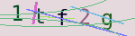
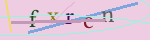
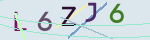
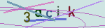
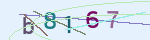
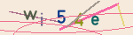

# captcha-a
a captcha library for rust

 |  | 
--- | --- | ---
 |  | 

## code example

```rust
use captcha_a::{CaptchaBuilder, Font};

fn main() {
    let fonts = vec![
        Font::try_from_bytes(include_bytes!("../fonts/captcha0.ttf")).unwrap(),
        Font::try_from_bytes(include_bytes!("../fonts/captcha1.ttf")).unwrap(),
        Font::try_from_bytes(include_bytes!("../fonts/captcha2.ttf")).unwrap(),
        Font::try_from_bytes(include_bytes!("../fonts/captcha3.ttf")).unwrap(),
        Font::try_from_bytes(include_bytes!("../fonts/captcha4.ttf")).unwrap(),
        Font::try_from_bytes(include_bytes!("../fonts/captcha5.ttf")).unwrap(),
    ];
    let builder = CaptchaBuilder {
        //custom attribute
        width: 120,
        height: 40,
        length: 4,
        fonts: &fonts,
        //default attribute
        ..Default::default()
    };
    for i in 0..6 {
        let save_path = format!("image_{}.png", i);
        //each save build and save a new image
        let phrase = builder.save(&save_path).unwrap();
        println!("[{}]phrase={}", i, phrase);
    }
    let captcha = builder.build().unwrap();
    //require base64 feature
    let base64_url = captcha.base64_url();
    println!("base64: phrase={}\n{}", captcha.phrase, base64_url);
}
```

