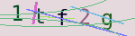
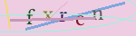
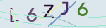
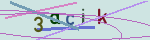
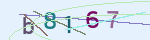
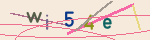

# captcha-a
a captcha library for rust

 |  | 
--- | --- | ---
 |  | 

## Usage

Add this to your `Cargo.toml`:

```toml
[dependencies]
captcha-a = "0.1.4"
```

or with `base64` feature, if you need base64_url

```toml
[dependencies]
captcha-a = { version ="0.1.4", features = ["base64"] }
```

## code example

```rust
use captcha_a::{CaptchaBuilder, Font};

fn main() {
    //load fonts
    let fonts = vec![
        Font::try_from_bytes(include_bytes!("./fonts/captcha0.ttf")).unwrap(),
        Font::try_from_bytes(include_bytes!("./fonts/captcha1.ttf")).unwrap(),
        Font::try_from_bytes(include_bytes!("./fonts/captcha2.ttf")).unwrap(),
        Font::try_from_bytes(include_bytes!("./fonts/captcha3.ttf")).unwrap(),
        Font::try_from_bytes(include_bytes!("./fonts/captcha4.ttf")).unwrap(),
        Font::try_from_bytes(include_bytes!("./fonts/captcha5.ttf")).unwrap(),
    ];
    let builder = CaptchaBuilder {
        //custom attribute
        width: 120,
        height: 40,
        length: 4,
        fonts: &fonts,
        //default attribute
        ..Default::default()
    };
    for i in 0..6 {
        let save_path = format!("image_{}.png", i);
        //each save build and save a new image
        let phrase = builder.save(&save_path).unwrap();
        println!("[{}]phrase={}", i, phrase);
    }
    let captcha = builder.build().unwrap();
    //require base64 feature
    let base64_url = captcha.base64_url();
    println!("base64: phrase={}\n{}", captcha.phrase, base64_url);
}
```

## use with actix-web example

```rust
use actix_web::{
    http::header,
    web::{self, Json},
    App, CustomizeResponder, HttpServer, Responder,
};
use captcha_a::{Captcha, CaptchaBuilder, Font, ImageResult};
use serde::Serialize;

///define a struct to hold fonts
pub struct CaptchaService {
    pub fonts: Vec<Font<'static>>,
}
///default impl
impl Default for CaptchaService {
    fn default() -> Self {
        //load fonts
        Self {
            fonts: vec![
                Font::try_from_bytes(include_bytes!("./fonts/captcha0.ttf")).unwrap(),
                Font::try_from_bytes(include_bytes!("./fonts/captcha1.ttf")).unwrap(),
                Font::try_from_bytes(include_bytes!("./fonts/captcha2.ttf")).unwrap(),
                Font::try_from_bytes(include_bytes!("./fonts/captcha3.ttf")).unwrap(),
                Font::try_from_bytes(include_bytes!("./fonts/captcha4.ttf")).unwrap(),
                Font::try_from_bytes(include_bytes!("./fonts/captcha5.ttf")).unwrap(),
            ],
        }
    }
}
//add build function
impl CaptchaService {
    pub fn build_captcha(&self) -> ImageResult<Captcha> {
        let builder = CaptchaBuilder {
            //custom attribute
            width: 150,
            height: 40,
            fonts: &self.fonts,
            //default attribute
            ..Default::default()
        };
        builder.build()
    }
}

///show captcha handler
#[actix_web::get("/img")]
async fn captcha_show(captcha_service: web::Data<CaptchaService>) -> CustomizeResponder<Vec<u8>> {
    let captcha = captcha_service
        .build_captcha()
        .expect("build captcha failed");
    //todo save captcha code in database or session
    println!("captcha code={}", captcha.phrase);
    let captcha_data = captcha.raw_data;
    captcha_data
        .customize()
        .insert_header((header::CONTENT_TYPE, "image/png"))
}

///api response
#[derive(Serialize)]
pub struct ApiResponse {
    pub image_url: String,
}

///use json with base64 data url handler
#[actix_web::get("/img-api")]
async fn captcha_json(captcha_service: web::Data<CaptchaService>) -> Json<ApiResponse> {
    let captcha = captcha_service
        .build_captcha()
        .expect("build captcha failed");
    //todo save captcha code in database or session
    println!("captcha code={}", captcha.phrase);
    let resp = ApiResponse {
        image_url: captcha.base64_url(),
    };
    Json(resp)
}

#[actix_web::main]
async fn main() -> std::io::Result<()> {
    //share service in handlers
    let captcha_service = web::Data::new(CaptchaService::default());
    println!("server run at: 127.0.0.1:8080");
    HttpServer::new(move || {
        App::new()
            .service(captcha_show)
            .service(captcha_json)
            //use app_data here
            .app_data(captcha_service.clone())
    })
    .bind(("127.0.0.1", 8080))?
    .run()
    .await
}
```

